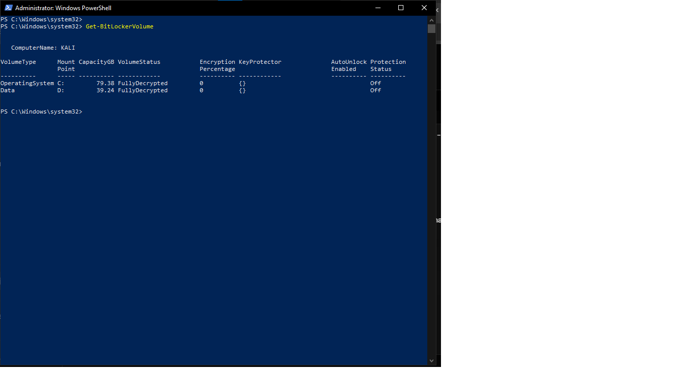
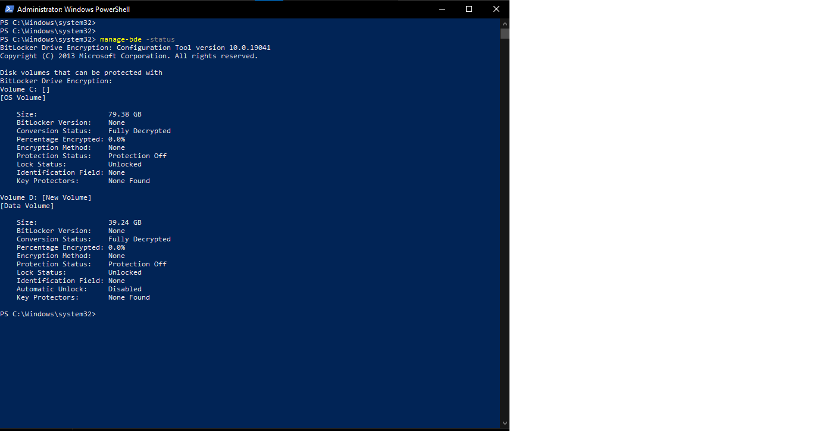

# 🔐 System Vulnerability Assessment Report
### DecodeLabs – Project 4 | System Vulnerability Checklist
**Auditor:** Mudasir Zia  
**Machine:** KALI (Windows 10 Pro Build 19045)  
**Date:** 16 August 2026  
**Scope:** Personal Primary Workstation – Blue Team Defensive Audit


---

## 📌 Executive Summary

A full 4-step System Vulnerability Checklist was executed on the primary Windows workstation using native PowerShell and command-line tools.  

**Three critical/high-risk findings** were identified related to disk encryption and password policy. Firewall posture and Guest account status were found to be correctly configured. This report documents the diagnosis, recommended remediation, and verification path.

---

## Section 1: Flaws Found (The Diagnosis)

### 1.1 Critical – Full Disk Encryption Disabled (BitLocker)

Both the Operating System volume (C:) and Data volume (D:) are in a **Fully Decrypted** state with **Protection Status: Off**.

- Encryption Percentage: 0.0%
- Key Protectors: None Found
- Impact: Complete loss of confidentiality if the device is lost, stolen, or physically accessed.

**CVSS-style Rating:** Critical (9.0 – 10.0 equivalent – Data at Rest unprotected)





---

### 1.2 High – Extremely Weak Password Policy

```text
Minimum password length:          0
Length of password history:       None
Maximum password age:             42 days
Minimum password age:             0