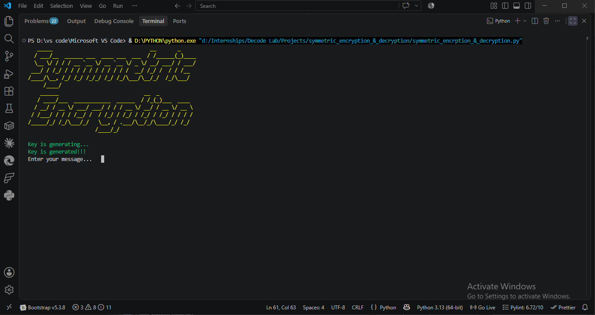
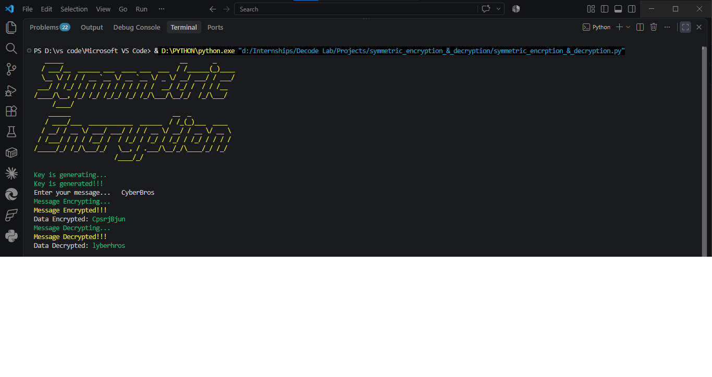

# 🔐 Symmetric Encryption & Decryption — Substitution Cipher (Python)


A command-line symmetric encryption tool implementing a randomized
monoalphabetic substitution cipher — generates a fresh shuffled key
each run, encrypts user input, then decrypts it back to verify
correctness. Built to demonstrate core symmetric cryptography concepts
(same key for both encryption and decryption) at a foundational level.

---

## 📌 Table of Contents
- [Overview](#overview)
- [How It Works](#how-it-works)
- [Usage](#usage)
- [Project Screenshots](#-project-screenshots)
- [Requirements](#requirements)
- [Concepts Demonstrated](#concepts-demonstrated)
- [Limitations](#limitations)
- [Next Steps](#next-steps)

---

## Overview

| | |
|---|---|
| **Type** | Symmetric-key substitution cipher |
| **Language** | Python 3 |
| **Key generation** | Randomized 26-letter alphabet shuffle, regenerated every run |
| **Scope** | Lowercase a-z only; non-alphabet characters (spaces, punctuation) pass through unchanged |

## How It Works

1. **Key Generation** — shuffles the 26-letter alphabet into a random
   permutation (`secret_key`). This shuffled string acts as the
   substitution map: position `i` in the original alphabet maps to the
   letter at position `i` in the shuffled key.
2. **Encryption** — for each letter in the input, finds its index in
   the standard alphabet, then substitutes the letter at that same
   index in the shuffled key.
3. **Decryption** — reverses the process: finds the letter's index in
   the shuffled key, substitutes the letter at that index in the
   standard alphabet — recovering the original message using the
   *same* key (hence "symmetric").

## Usage
```bash
pip install colorama pyfiglet
python symmetric_encryption_&_decryption.py
```
Enter any message when prompted — the tool displays the generated
key process, encrypted output, and decrypted output in sequence, then
loops to accept another message.

---

# 📸 Project Screenshots

## 🚀 Application Startup
When the application starts, it displays an ASCII-art banner, generates a brand-new random substitution key, and waits for the user to enter a message for encryption.


---

## 🔐 Encryption & Decryption Demonstration
The screenshot below demonstrates the complete workflow. After entering a plaintext message, the application encrypts it using the randomly generated substitution key and immediately decrypts it back using the same key, verifying that the original plaintext is successfully recovered.


---

## Requirements
- Python 3.x
- `colorama` — colored terminal output
- `pyfiglet` — ASCII art banner

## Concepts Demonstrated
- Symmetric-key cryptography (one shared key for both directions)
- Monoalphabetic substitution cipher mechanics
- Random key generation via Fisher-Yates style shuffle (`random.shuffle`)
- Basic OOP structure (encryption/decryption logic encapsulated in a class)

## Limitations
- **Not cryptographically secure** — a simple substitution cipher is
  breakable via frequency analysis and is intended for educational
  purposes only, not real-world data protection.
- **Known casing bug**: input with uppercase letters (e.g. "CyberBros")
  is lowercased before decryption, causing the decrypted output to lose
  original casing entirely (observed in testing: `CyberBros` → `lyberhros`
  after an encrypt/decrypt round-trip) — decryption is only reliable for
  all-lowercase input.
- Only supports lowercase English letters — numbers and uppercase
  letters are not substituted (passed through as-is on encryption, but
  dropped during decryption since they aren't in `secret_key`).

## Next Steps
- Fix the casing bug by preserving original letter case through encryption and decryption instead of lowercasing input.
- Support numbers/symbols in the substitution map.
- Replace with a real symmetric algorithm (e.g. AES via Python's `cryptography` library) to compare classical vs. modern symmetric encryption.
- Add a CLI flag to persist/reuse a specific key instead of regenerating randomly each run, to demonstrate proper key exchange/reuse scenarios.

---

**Author**: Mudasir Zia | [GitHub](https://github.com/CyberBros435)
